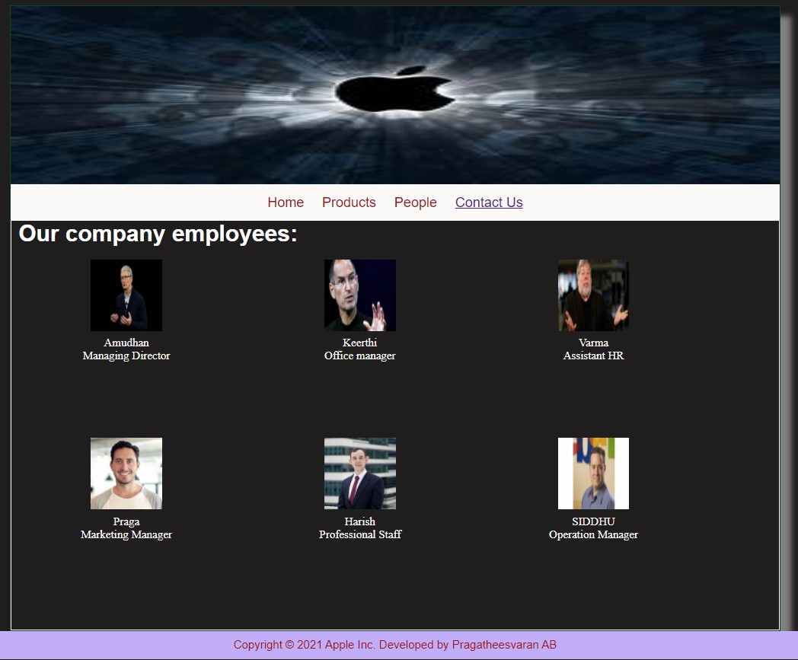

# Web Design for a Software Product Company

## AIM:

To design a static website for a software product company company.

## DESIGN STEPS:

### Step 1:

Requirement collection.

### Step 2:

Creating the layout using HTML and CSS.

### Step 3:

Updating the sample content.

### Step 4:

Choose the appropriate style and color scheme.

### Step 5:

Validate the layout in various browsers.

### Step 6:

Validate the HTML code.

### Step 6:

Publish the website in the given URL.

## PROGRAM :

### Home Page:
~~~
<!DOCTYPE html>
<html lang="en">
  <head>
    <title>Apple Inc.</title>
    <link rel="stylesheet" href="./css/layout.css" />
    <link rel="icon" href="./img/icon.png" type="image/x-icon" />
  </head>

  <body>
    

      
Apple Inc.

      

        
<a href="/static/home.html">Home</a>

        
<a href="/static/products.html">Products</a>

        
<a href="/static/people.html">People</a>

        
<a href="/static/contactus.html">Contact Us</a>

        

      

        

          <h1>About Us</h1>
          
          

            Apple Inc. is an American multinational technology company that specializes in consumer electronics, computer software and online services. Apple is the largest information technology company by revenue (totaling $274.5 billion in 2020) and, since January 2021, the world's most valuable company. As of 2021, Apple is the fourth-largest PC vendor by unit sales[9] and fourth-largest smartphone manufacturer.[10][11] It is one of the Big Five American information technology companies, alongside Amazon, Alphabet (Google), Meta (Facebook), and Microsoft.[12][13][14]

            Apple was founded in 1976 by Steve Jobs, Steve Wozniak and Ronald Wayne to develop and sell Wozniak's Apple I personal computer. It was incorporated by Jobs and Wozniak as Apple Computer, Inc. in 1977, and sales of its computers, among them the Apple II, grew quickly. It went public in 1980, to instant financial success. Over the next few years, Apple shipped new computers featuring innovative graphical user interfaces, such as the original Macintosh, announced in a critically acclaimed advertisement, "1984", directed by Ridley Scott. The high cost of its products and limited application library caused problems, as did power struggles between executives. In 1985, Wozniak departed Apple amicably,[15] while Jobs resigned to found NeXT, taking some Apple employees with him.[16]
            
            As the market for personal computers expanded and evolved throughout the 1990s, Apple lost considerable market share to the lower-priced duopoly of Microsoft Windows on Intel PC clones. The board recruited CEO Gil Amelio, who prepared the struggling company for eventual success with extensive reforms, product focus and layoffs in his 500-day tenure. In 1997, Amelio bought NeXT to resolve Apple's unsuccessful operating-system strategy and entice Jobs back to the company; he replaced Amelio. Apple became profitable again through a number of tactics. First, a revitalizing campaign called "Think different", and by launching the iMac and iPod. In 2001, it opened a retail chain, the Apple Stores, and has acquired numerous companies to broaden its software portfolio. In 2007, the company launched the iPhone to critical acclaim and financial success. Jobs resigned in 2011 for health reasons, and died two months later. He was succeeded as CEO by Tim Cook.
            
            The company receives significant criticism regarding the labor practices of its contractors, its environmental practices, and its business ethics, including anti-competitive behavior and materials sourcing. In August 2018, Apple became the first publicly traded U.S. company to be valued at over $1 trillion,[17][18] and, two years later, the first valued at over $2 trillion.[19][20] The company enjoys a high level of brand loyalty, and is ranked as the world's most valuable brand; as of January 2021, there are 1.65 billion Apple products in active use.[21]
            
          

        

      

      

        Copyright &#169; 2021 Apple Inc. Developed by Pragatheesvaran AB 
      

    

  </body>
</html>
~~~

### Products:
~~~
<!DOCTYPE html>
<html lang="en">
  <head>
    <title>Apple Inc.</title>
    <link rel="stylesheet" href="./css/layout.css" />
    <link rel="icon" href="./img/icon.png" type="image/x-icon" />
  </head>

  <body>
    

      

      

        
<a href="/static/home.html">Home</a>

        
<a href="/static/products.html">Products</a>

        
<a href="/static/people.html">People</a>

        
<a href="/static/contactus.html">Contact Us</a>

        

      

        
    
          <h1>Our Premium Products</h1>
          

              
 
                  

                  
                  

                  
Apple 10S

                  
Price: Rs.39500/- 

              

              
 
                  

                  
                  

                  
Air pods

                  
Price: Rs.4500/- 

              

              
 
                

                
                

                
Apple tv

                
Price: Rs.4700/- 

              

              
 
                

                
                

                
Desktop

                
Price: Rs.200099/- 

            

            
 
              

              
              

              
Headphone

              
Price: Rs.40000/- 

          
  
 
            

            
            

            
Tab

            
Price: Rs.99970/- 

          
  
 
            

            
            

            
Macbook

            
Price: Rs.121070/- 

          
  
 
            

            
            

            
Macbook pro

            
Price: Rs.222570/- 

          
  
 
            

            
            

            
iWatch

            
Price: Rs.65000/- 

        

      
            

          

          
        
      

      

        Copyright &#169; 2021 Apple Inc. Developed by Pragatheesvaran AB
      

    

  </body>
</html>
~~~

### People:
~~~
<!DOCTYPE html>
<html lang="en">
  <head>
    <title>Apple Inc.</title>
    <link rel="stylesheet" href="./css/layout.css" />
    <link rel="icon" href="./img/ail.png" type="image/x-icon" />
    </head>
    <body>
    

      

      

        
<a href="/static/home.html">Home</a>

        
<a href="/static/products.html">Products</a>

        
<a href="/static/people.html">People</a>

        
<a href="/static/contactus.html">Contact Us</a>

        

      

        

          <h1>Our company employees:</h1>  
          

            
 
                

                
                

                
Amudhan

                
Managing Director

            

            
 
                

                
                

                
Keerthi

                
Office manager

            

            
 
              

              
              

              
Varma

              
Assistant HR

            

            
 
              

              
              

              
Praga

              
Marketing Manager

          

          
 
            

            
            

            
Harish

            
Professional Staff

        
  
 
          

          
          

          
SIDDHU

          
Operation Manager

      

          

        

        
        
    

    

      Copyright &#169; 2021 Apple Inc. Developed by Pragatheesvaran AB
    

  

</body>
</html>
~~~

### Contact Us:
~~~
<!DOCTYPE html>
<html lang="en">
  <head>
    <title>Apple Inc.</title>
    <link rel="stylesheet" href="./css/layout.css" />
    <link rel="icon" href="./img/ail.png" type="image/x-icon" />
  </head>

  <body>
    

      

      

        
<a href="/static/home.html">Home</a>

        
<a href="/static/products.html">Products</a>

        
<a href="/static/people.html">People</a>

        
<a href="/static/contactus.html">Contact Us</a>

      

      

        

          <h1>Contact Us:</h1>  
          <h1>Address:</h1>  
          

            75/W Apple Park Inc., 
            Cupertino, 
            Califonia.
          
 
          <h1>Phone:</h1>  
          

              Mr.Rajesh  (MARKETING MANAGER): 8660156869  
              Mr.Siddharth (OPERATION MANAGER): 8868432145  
              Mr.Vijay (OFFICE MANAGER): 7384588585  
          

          <h1>E-Mail:</h1>  
          

              Sales:appleinc@gmail.com
          

        

      

      

        Copyright &#169; 2021 Apple Inc. Developed by Pragatheesvaran AB
      

    

  </body>
</html>
~~~

## OUTPUT:

### Home Page:

### Products:

### People:

### Contact Us:

## Result:

Thus a website is designed for the software product company and the HTML,CSS code are validated.
